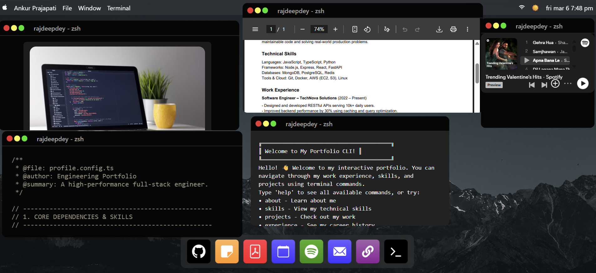

<div align="center">
  <h3 align="center">My Mac OS - Portfolio</h3>
  
</div>

## 📋 <a name="table">Table of Contents</a>

1. 🤖 [Introduction](#introduction)
2. ⚙️ [Tech Stack](#tech-stack)
3. 🔋 [Features](#features)
4. 🤸 [Quick Start](#quick-start)
   - [Prerequisites](#prerequisites)
   - [Cloning the Repository](#cloning-the-repository)
   - [Running the Project](#running-the-project)
   - [How to Use It](#how-to-use-it)

## <a name="introduction">🤖 Introduction</a>

Welcome to **My Mac OS** — a macOS-inspired interactive portfolio built with React and Vite! This project simulates a desktop environment in the browser, featuring a dock with clickable app icons that open draggable, resizable windows. It includes a GitHub viewer, a Notes app, a Resume viewer, a Spotify embed, a Terminal (CLI) with custom commands, and quick-launch links for Mail, LinkedIn, and Google Calendar.

Built with `Vite` for fast development and hot module replacement, and styled with `SASS` for component-level scoped styles.

## <a name="tech-stack">⚙️ Tech Stack</a>

- **React 19**
- **Vite**
- **SASS**
- **react-rnd** (draggable & resizable windows)
- **react-console-emulator** (interactive terminal)
- **react-markdown** (markdown rendering)
- **react-syntax-highlighter** (code syntax highlighting)

## <a name="features">🌟 Features</a>

👉 **macOS-style Dock**: A sleek dock at the bottom with animated app icons to launch windows and external links.

👉 **Draggable & Resizable Windows**: All app windows can be freely moved and resized across the desktop using `react-rnd`.

👉 **GitHub Viewer**: Browse and view GitHub repositories and profile data directly from the desktop.

👉 **Notes App**: A built-in note viewer with markdown rendering and syntax highlighting support.

👉 **Resume Viewer**: View a PDF resume directly inside a native-style window.

👉 **Spotify Embed**: Listen to music without leaving the portfolio via an embedded Spotify player.

👉 **Interactive Terminal (CLI)**: A fully functional terminal emulator with custom commands — `about`, `skills`, `projects`, `experience`, `contact`, `github`, `resume`, `social`, and `echo`.

👉 **Quick-Launch Links**: One-click shortcuts to Google Calendar, Mail, and LinkedIn from the dock.

👉 **macOS-style Navigation Bar**: A top nav bar with the current date and time display.

## <a name="quick-start">🤸 Quick Start</a>

### Prerequisites

Make sure you have the following installed on your machine:

- Git
- Node.js
- npm (Node Package Manager)

### Cloning the Repository

```bash
git clone https://github.com/gitcohub/my_mac_os.git
cd my_mac_os
```

### Running the Project

Install dependencies:

```bash
npm install
```

Start the development server:

```bash
npm run dev
```

Open your browser and navigate to `http://localhost:5173`.

### How to Use It

**`Dock`**

👉 **Launching Apps**: Click any icon in the dock to open its corresponding window on the desktop.

👉 **External Links**: Click the Calendar, Mail, or LinkedIn icons to open them in a new tab.

**`Windows`**

👉 **Moving Windows**: Click and drag any window by its title bar to reposition it on the desktop.

👉 **Resizing Windows**: Drag the edges or corners of any window to resize it.

👉 **Closing Windows**: Click the red close button in the window's title bar to dismiss it.

**`Terminal (CLI)`**

👉 **Available Commands**: Type `help` to see all commands, or try any of the following:

| Command      | Description                        |
|--------------|------------------------------------|
| `about`      | Learn about me                     |
| `skills`     | List technical skills              |
| `projects`   | View projects                      |
| `experience` | Display work experience            |
| `contact`    | Get contact information            |
| `github`     | Open GitHub profile in new tab     |
| `resume`     | Download resume                    |
| `social`     | View social media links            |
| `echo`       | Echo a passed string               |

**`GitHub Viewer`**

👉 **Browsing Repos**: Open the GitHub window from the dock to explore repository information.

**`Resume Viewer`**

👉 **Viewing Resume**: Click the PDF icon in the dock to open the resume viewer window.

**`Spotify`**

👉 **Playing Music**: Open the Spotify window from the dock to access the embedded music player.

## <a>🚨 Disclaimer</a>

This macOS-inspired portfolio is intended for personal and educational purposes only. It is not affiliated with or endorsed by Apple Inc. or Spotify.